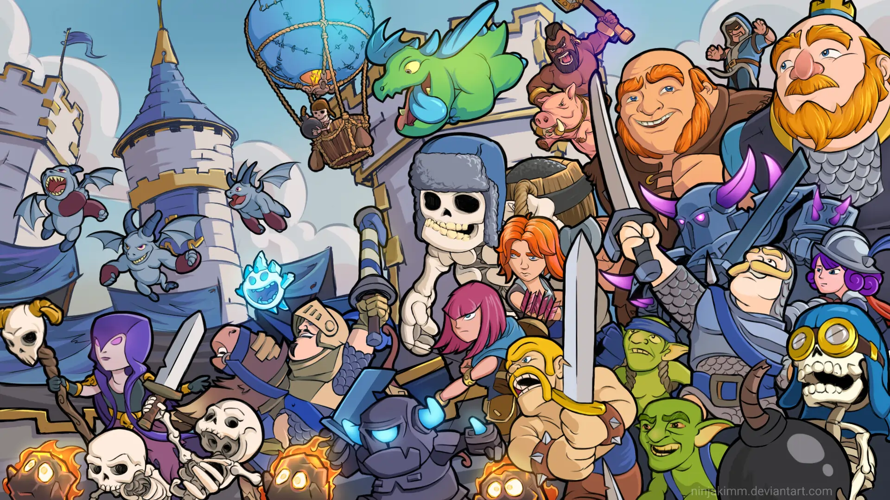
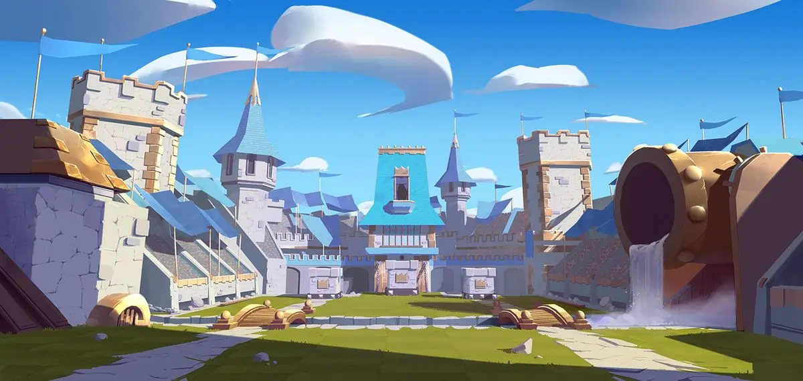
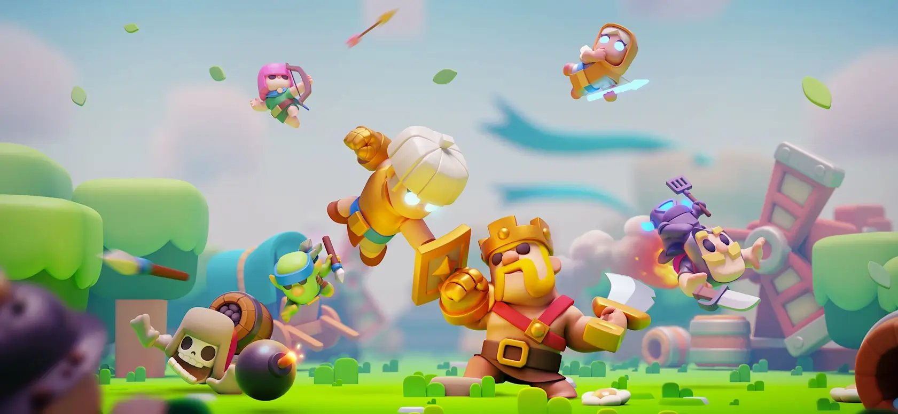

Illustration by [Ghulam Rouhan Samdani](https://www.artstation.com/ninjakimm) on [Artstation](https://www.artstation.com/).

Yesterday, my cousin asked me if I didn't play chess. I answered no. However, I have played it, and let's say I enjoyed it as well. I can see where this question is coming from. The recent rise in chess's fame is the factor, and he probably saw a YouTube Short about it.

## Characteristics of Chess

Interestingly, I was playing Clash Royale on my phone at the time, and my mind suddenly made a connection between these two games. Some characteristics of Chess include,

1.  Chess is a two-player game, always resulting in either a win, defeat, or draw.
2.  Chess is a board game with a 64-tile area.
3.  Chess has six different pieces, each with its own unique playing style.
4.  Chess has an ever-changing meta. (Meta is the most effective set of strategies available or devised in the game.)
5.  Chess has several competitive playing modes, such as classical, rapid, and blitz. _(among others)_
6.  Chess has a welcoming community for newcomers, with forums discussing elaborate strategies and game plans.

Now, let's compare chess with Clash Royale. This video game is remarkably similar to classic chess. Along with a spectacular community, Clash Royale offers everything from tile-based game mechanics to a dynamic meta. One might argue that it's just a video game for kids. Let me present some facts, then.

Each piece in chess has a defined way of moving. For example, rooks can only move in the four cardinal directions (north, south, east, and west), while bishops move diagonally in the intercardinal directions (northeast, northwest, southeast, and southwest). Similarly, the movement of every other piece can be explained and follows a constrained pattern.

Like chess, Clash Royale offers a plethora of units that are not constrained by direction of movement but rather by their duty, role, or target. Consider Giants, for example, which are solely focused on destroying towers or defensive buildings. They do not interact with any other troop or _piece_ on the board.

## What is Clash Royale?

Let me tell you what Clash Royale is actually.

> Clash Royale is a multiplayer game featuring Clash characters. Players collect cards, destroy towers, and win trophies.

from [clash royale website](https://supercell.com/en/games/clashroyale/) and summarized by gemini.

Gameplay image.

At any given moment, you'll be presented with four cards (or _pieces_) from your previously selected deck of eight cards. Use combinations of these cards on the field to destroy or capture opponents' towers. There are three towers: two princess towers on each side and a king's tower in the center. Destroying any one tower grants you one crown, and the winner is the player who has collected the most crowns at the end of a 3-minute duel.

Additionally, a constantly refilling elixir bar is in place to prevent card spamming and allow you to devise creative strategies and precise timings to control the battle's outcome. The entire battlefield is divided into tiles, and the correct tile placement of cards plays a pivotal role, as a single tile difference can cause your troop to take the wrong lane.

On top of everything, there are more than 100 cards or troops or _pieces_ to pick from to craft your deck. The game includes a trophy ladder and elo rating systems. The timely balance changes keep shifting the meta. Thus, you need to be on your toes to save your spot of the top ladder. 😉

## Enters Clash Mini

Back on April 2, 2021, Supercell announced the development of an even more chess-like, turn-based game called _Clash Mini_. I tried its beta program, and it indeed felt like a more board-like experience.

The concept of the game was very similar to what I described earlier. Unfortunately, due to low engagement, the game was discontinued. Nevertheless, it was a great example of a strategy-based game.

## A Word about Supercell

Since my childhood, I've enjoyed games made by Supercell. _Clash of Clans_ and _Clash Royale_ have been my favorites. I want to extend my thanks to Supercell for creating such beautiful memories and for crafting such marvelous pieces of code that handle everything so seamlessly.

Games make for a great coding exercise and require more than just ordinary mental effort to build. Supercell has done an incredible job maintaining servers, managing transactions, handling real-time events, and supporting a massive community.

Hats off to you! 👏

## Conclusion

Nonetheless, this video game showcases the evolution of board games with the help of computers. What fascinates me even more is how computers have enabled us to think beyond the conventional paths or tangents. We can now animate the rooks on the board, requiring players to calculate their behavior before deploying them.

There are a ton of games inspired by chess that borrow heavily from it in terms of mechanics, moves, or design. It is similar to the Lego effect, how even adults play with them. Sorry, craft experiences with them. I see many adults playing strategy-based video games, just like the adult players in chess. It would be extremely rigid to place these two in entirely separate categories. After all, chess is simply a two-player, turn-based game that can be enjoyed by people of any age group.

If you still believe chess is something entirely different from such games, I suggest you step outside and touch some grass.
