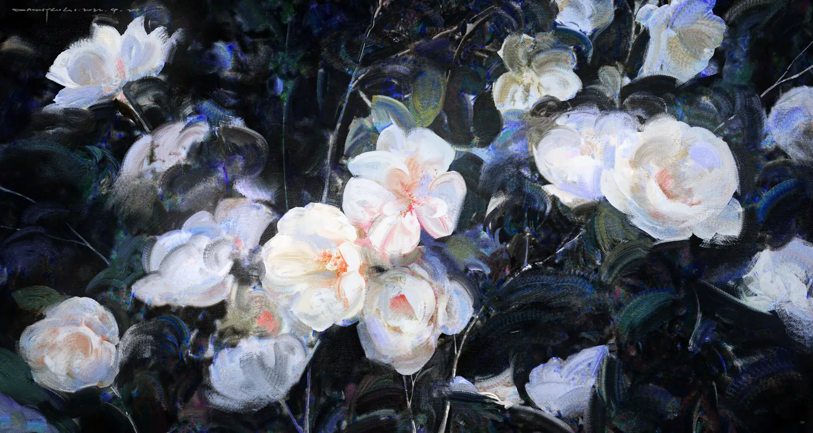
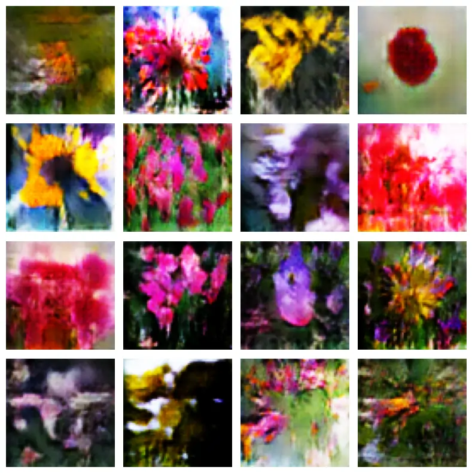
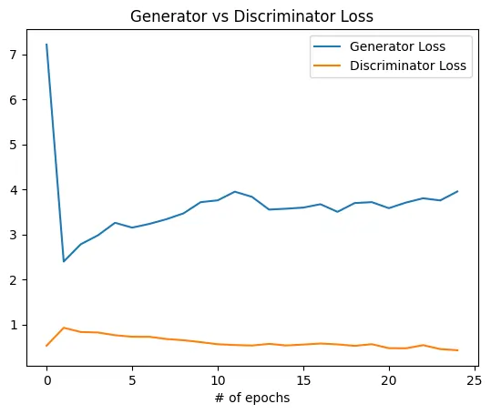

Image at [ArtStation](https://www.artstation.com/artwork/qQPleN) by [DannyLaiLai](https://www.artstation.com/danny008)

GANs, or **Generative Adversarial Networks**, were first introduced by [Ian Goodfellow](https://arxiv.org/abs/1406.2661) and others. They function as a game between two neural networks: the _Discriminator_, which tries to differentiate between real and fake images, and the _Generator_, which attempts to mimic real data and fool the Discriminator. Through sufficient training, the Generator learns to produce lifelike results.

Later in 2015, [Alec Radford](https://arxiv.org/abs/1511.06434) introduced the use of convolutional layers for images, along with batch normalization and other improvements, which significantly enhanced the quality of generated outputs. I recreated the same architecture, and after training for just 25 epochs, I was able to achieve convincing results.

I know these aren't crystal clear or crisp; however, they serve as solid proof that the network is learning and heading in the right direction.

Notebook: [Flower GAN at Kaggle](https://www.kaggle.com/code/ashishk1331/flower-gan/notebook)



## Dataset

Dataset used for training the GAN: [Flower Classification: 14 Types of Flower Image Classification](https://www.kaggle.com/datasets/marquis03/flower-classification) assembled by [Marquis03](https://www.kaggle.com/marquis03).

The dataset contains 14 types of flower images, including 13618 training images and 98 validation images, with a total data size of 202MB, and supports the recognition of the following flower types: carnation, iris, bluebells, golden english, roses, fallen nephews, tulips, marigolds, dandelions, chrysanthemums, black-eyed daisies, water lilies, sunflowers, and daisies.

## Constants Used

| Parameter     | Value  |
| ------------- | ------ |
| batch_size    | 64     |
| image_size    | 64     |
| latent_dim    | 100    |
| learning rate | 0.0002 |
| beta1         | 0.5    |
| epochs        | 25     |
| img_channels  | 3      |

## Generator

The generator is a sequential stack of _five_ transposed convolutional layers, each followed by a batch normalization layer and a _ReLU_ activation function. However, as mentioned in the paper, the final block (or last set of layers) does **not** include a normalization layer and uses _Tanh_ as the activation function.

```python
class Generator(nn.Module):
    def __init__(self, latent_dim, ngf, nc):
        super(Generator, self).__init__()
        self.model = nn.Sequential(
            self._block(latent_dim, ngf * 8, 4, 1, 0),
            self._block(ngf * 8,    ngf * 4, 4, 2, 1),
            self._block(ngf * 4,    ngf * 2, 4, 2, 1),
            self._block(ngf * 2,    ngf,     4, 2, 1),

            # Output layer
            nn.ConvTranspose2d(ngf, nc, 4, 2, 1),
            nn.Tanh(),
        )

    def _block(self, inc, out, k_size, stride, pad):
        return nn.Sequential(
            nn.ConvTranspose2d(inc, out, k_size, stride, pad, bias=False),
            nn.BatchNorm2d(out),
            nn.ReLU(True),
        )

    def forward(self, x):
        return self.model(x)
```

The _ConvTranspose_ layer is used to upscale the input matrix and increase the number of features. It works by applying a reverse convolution operation, which increases the spatial dimensions (height and width) of the input while simultaneously increasing the number of channels (depth).

### Architecture Guidelines for Stable Deep Convolutional GANs:

- Replace **pooling layers** with:
  - **Strided convolutions** in the discriminator
  - **Fractional-strided convolutions** in the generator
- Use **batch normalization** in both the generator and discriminator.
- **Remove fully connected hidden layers** for deeper architectures.
- Use **ReLU activation** in the generator for all layers except the output, which uses **Tanh**.
- Use **LeakyReLU activation** in the discriminator for all layers.

## Discriminator

The discriminator also consists of _five_ convolutional layers, each followed by batch normalization and a _LeakyReLU_ activation function. However, the first layer does not include batch normalization, and the activation function for the final block is the _Sigmoid_ function.

```python
class Discriminator(nn.Module):
    def __init__(self, ndf, nc):
        super(Discriminator, self).__init__()
        self.model = nn.Sequential(
            nn.Conv2d(nc, ndf, 4, 2, 1, bias=False),
            nn.LeakyReLU(.2, inplace=True),

            self._block(ndf    , ndf * 2),
            self._block(ndf * 2, ndf * 4),
            self._block(ndf * 4, ndf * 8),

            # Output Layer
            nn.Conv2d(ndf * 8, 1, 4, 1, 0, bias=False),
            nn.Sigmoid(),
        )

    def _block(self, inc, out):
        return nn.Sequential(
            nn.Conv2d(inc, out, 4, 2, 1, bias=False),
            nn.BatchNorm2d(out),
            nn.LeakyReLU(0.2, inplace=True),
        )

    def forward(self, x):
        return self.model(x).view(-1)
```

## Training and Losses

The _Adam_ optimizer was used to update the weights of each network, as described in the DCGAN paper. Additionally, a simple _Binary Cross Entropy Loss_ was used as the loss function.

```python
criterion = nn.BCELoss()

optim_g = optim.Adam(generator.parameters(),     lr=lr, betas=(beta1, 0.999))
optim_d = optim.Adam(discriminator.parameters(), lr=lr, betas=(beta1, 0.999))
```

After training both networks in an adversarial manner for `25` epochs, the generator began to learn and showed positive signs of progress.



### Training Setup Summary:

- **Pre-processing**: No pre-processing applied to training images besides scaling to the range of the Tanh activation function [-1, 1].
- **Training method**: Mini-batch stochastic gradient descent (SGD) with a mini-batch size of 128.
- **Weight initialization**: Weights initialized from a zero-centered Normal distribution with standard deviation 0.02.
- **LeakyReLU**: The slope of the leak was set to 0.2 in all models.
- **Optimizer**: Adam optimizer (Kingma & Ba, 2014) with tuned hyperparameters.
  - **Learning rate**: Used 0.0002 instead of the suggested 0.001.
  - **Momentum term**: Reduced momentum term from 0.9 to 0.5 to stabilize training and avoid oscillations.

My Own Variable Values:

1. I chose mini-batches of `64`.
2. I used Adam for both networks.

## Papers followed:

1. [Generative Adversarial Networks](https://arxiv.org/abs/1406.2661)
2. [Unsupervised Representation Learning with Deep Convolutional Generative Adversarial Networks](https://arxiv.org/abs/1511.06434)
