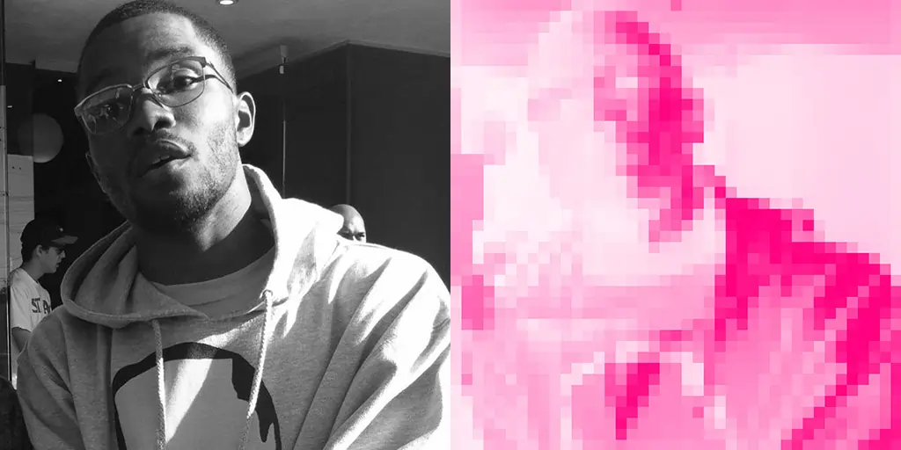

This is [Frank Ocean](https://en.wikipedia.org/wiki/Frank_Ocean), with a pixelated effect. Doesn't it look great? The effect really stands out. Frank is already a superstar, and his albums are exemplary. You should try them! If you ask me, start with _lost_ from _channel orange_.

## Introduction

I wanted to create an image-generating model, and the simplest model I found was GANs — Generative Adversarial Networks.

Generative Adversarial Networks (GANs) were introduced in 2014 by Ian Goodfellow and his collaborators in the paper titled [_"Generative Adversarial Nets."_](https://arxiv.org/abs/1406.2661) The paper describes two networks competing in an adversarial manner.

It consists of a _Generator_, which generates fake data that looks like the original, and a _Discriminator_, which tries to distinguish the fake data from the real.

In this manner, we are able to train a generator that can produce images that closely resemble the originals.

The main problem was that if I were to train a simple GAN on a limited device, it wouldn't be able to produce great results — the images often contained several noticeable blemishes.

Later, I came across a [Pinterest post](https://in.pinterest.com/pin/711146597448474391/) where a pixel effect was applied to an image, and it made me think that pixelated images could help overcome the constraints of the limited training resources at my disposal. Pixelated images are easily recognizable — and they are a form of _art!_

## Prerequisites

I took the easy route and used the [Celebrity Face Image Dataset](https://www.kaggle.com/datasets/vishesh1412/celebrity-face-image-dataset), which contains over 1,800 images of celebrity faces from 18 individuals. I used `ImageFolder` to read all the images, along with the following transforms:

1. **Grayscale** – Reduced the number of channels to 1 for simplicity.
2. **Resize** – Resized the images to fit within the neural network.
3. **AbsCenterCrop** – A transform that crops the image into the best square box centered in the image.

```python
class AbsCenterCrop:
    def get_center_box(self, width: int, height: int) -> (int, int, int, int):
        if width == height:
            return (0, 0, width, height)
        elif width < height:
            up = (height - width) // 2
            return (0, up, width, width + up)
        else:  # width > height
            left = (width - height) // 2
            return (left, 0, height + left, height)

    def __call__(self, image: Any):
        bbox = self.get_center_box(*image.size)
        image = image.crop(bbox)
        return image
```

4. **Pixelator** – A transform that downscales the image using the mean of pixel regions.

```python
class Pixelator:
    def __init__(self, boxes = 40):
        self.boxes = boxes

    def __call__(self, image: Image.Image):
        img_tensor = torch.from_numpy(
            np.array(image, dtype=np.float32)
        ) / 255.0 # Convert to float and scale to [0, 1]
        width, height = image.size
        sample = width // self.boxes

        res = []
        for i in range(0, height, sample):
            temp = []
            for j in range(0, width, sample):
                sub_tensor = img_tensor[i:i + sample, j:j + sample]
                temp.append(sub_tensor.mean().item()) # Use float mean
            res.append(temp)

        return torch.tensor(res, dtype=torch.float).unsqueeze(0)
```

All these transforms bake the images into a grid of pixels that closely represent the original image.

## Generator

A sequential neural network that converts vectors from a latent space into a flat image vector.

```python
class Generator(nn.Module):
    def __init__(self, latent_dim, image_size):
        super(Generator, self).__init__()
        self.model = nn.Sequential(
            nn.Linear(latent_dim, 128),
            nn.LeakyReLU(.2),
            nn.Linear(128, 512),
            nn.LeakyReLU(.2),
            nn.Linear(512, image_size*image_size),
            nn.Tanh(),
        )

    def forward(self, x):
        return self.model(x)
```

## Discriminator

A simple sequential model to distinguish between fake and real images.

```python
class Discriminator(nn.Module):
    def __init__(self, image_size):
        super(Discriminator, self).__init__()
        self.model = nn.Sequential(
            nn.Linear(image_size*image_size, 128),
            nn.LeakyReLU(.2),
            nn.Linear(128, 1),
            nn.Sigmoid(),
        )
    def forward(self, x):
        return self.model(x).view(-1, 1)
```
