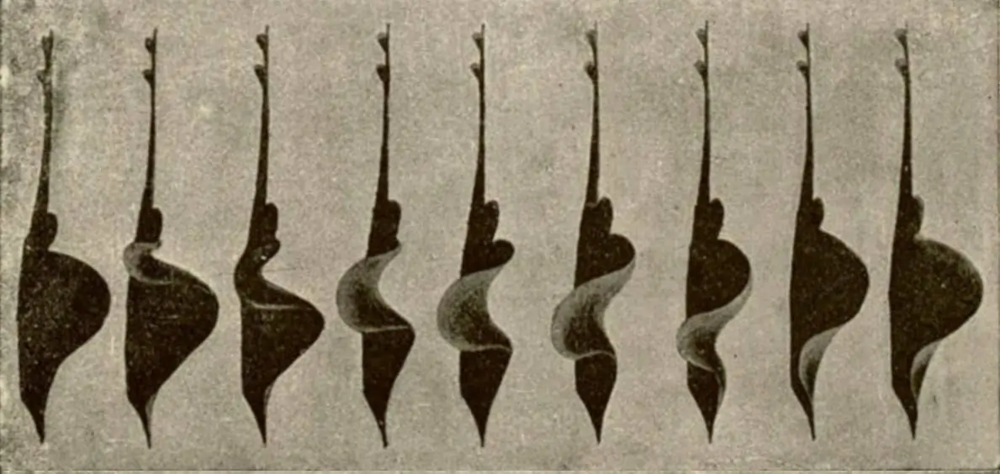

One of the patterns I came across while studying deep learning is the _Sequential Pattern_ of layers in a neural network. It can also be called a list of _Serial Transformations_ because you have a sequence of functions that apply certain transformations, where the input shape of the data remains identical to the output shape.

You can think of it as an attendance sheet being circulated among all attendees, where each person signs their initials next to their name. Once everyone has signed, the state of the attendance sheet has changed compared to its original state.

A sample of a sequential model in PyTorch:

```python
import torch.nn as nn

model = nn.Sequential(
    nn.Linear(32, 64),
    nn.Linear(64, 1),
    nn.Sigmoid(),
)
```

Here is a three-layer model where the input shape of each layer matches the output of the previous layer. The first layer takes an input of length 32 and produces an output of length 64. The second layer accepts an input of length 64, which matches the output shape of the first layer, and subsequently produces an output of length 1, which is then passed through a sigmoid activation function.

Although the intermediate data shape needs to be identical, not all intermediate representations need to be the same, as portrayed in the snippet.

For simplicity, I'll be discussing a model with only one intermediate representation state. Here, it will be a list of objects, and transformations will affect the length of the list as well as the properties of the inner objects.

To be clear, I'm talking about the coding pattern not the neural network model.

## Example - Feather


Feather is a simple task management tool for your daily chores. It includes features such as archiving tasks, applying filters (including tags or days), and searching for tasks. All tasks are displayed in a single container on the home screen, ensuring that users are not redirected to different pages when activating features.

This meant that I need to apply transformations to the list before rendering it. Also, this means that I need to track the transformations with a series of if statements. This if-ladder hint me about the similarity between the ladder and the sequential model in pytorch.

### Key Points

1. Every transformation is independent.
2. Easy extension.
3. Modular approach.

Since every `if` statement returns a `Task[]` object, why not abstract the transformation into functions? This way, they can be used like LEGO pieces to build the final result.

```javascript
const tasksToDisplay = taskMutations(tasks, [
  // view archived or normal tasks
  (t) =>
    viewArchived
      ? t.filter((task) => task.archived)
      : t.filter((task) => !task.archived),

  // find tasks for today
  (t) => (viewAll ? t : todayTasks),

  // apply filters to the tasks
  (t) => subsetTasksWithFilters(t, appliedFilters),

  // search through tasks
  (t) => (search.length > 0 ? searchThroughTasks(t, search) : t),
]);
```

Here, we have four functions (layers) that accept `tasks` (a list of task objects) and output the same, which in turn serves as the input for the next function. The only catch here is the order of events/transformations taking place.

### All Transformations Applied

1. View archived tasks if the archive button is switched on.
2. Filter out all tasks that are to be completed on the selected day.
3. Apply the selected filters to the tasks.
4. Subset only tasks that contain the search text.

All functions are independent and do not talk to each other. Best part is the ability to extend the list of transformation easily.

## Conclusion

Hence, you can use the _Sequential Pattern_ to support a list of transformations with features like isolation and extendability. There are many other examples that utilize this pattern, such as the PyTorch `Sequential` model.

If you have an example, please feel free to share it!
